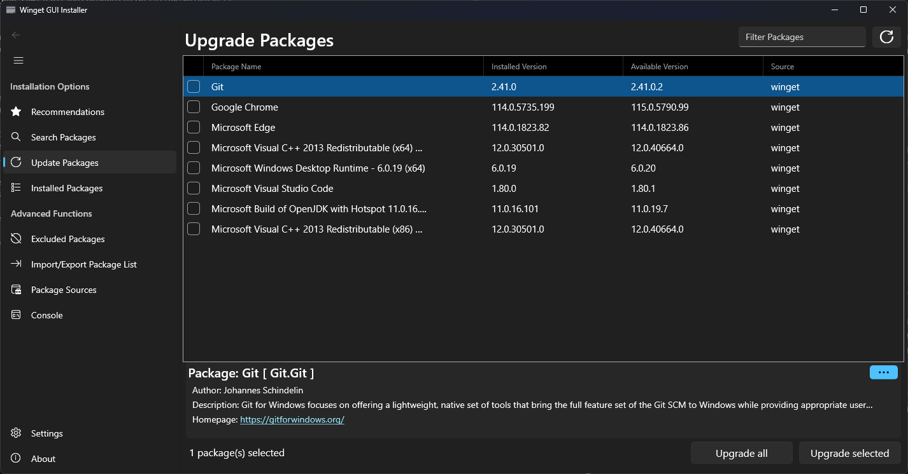

#  Winget GUI Installer 

GUI Tool to Install and Update packages relying on the ```winget``` command line package manager utility. Includes support for batched Import and Export and single click Updates, Package source management and Exclusions

## License

The code in this repository is licensed under the [MIT](https://github.com/zsolt3991/WingetGUIInstaller/blob/master/LICENSE) license.

## Installation

### Dependencies
This application relies on the .NET ecosystem and requires .NET 6 Desktop App runtime to execute. Latest release can be found at [.NET Runtime Download Page](https://dotnet.microsoft.com/en-us/download/dotnet/6.0)

### Supported Platforms
- Windows 10 32 and 64 bit
- Windows 11 32 and 64 bit

### Sideloading Instructions

The application releases provide a sideloadable ```.msix``` file for each of the supported platforms. This can be installed only on systems where Developer Mode is enabled to allow sideloading.

To install:
1. Download the latest application release for your platform from the [repository](https://github.com/zsolt3991/WingetGUIInstaller/releases/)
2. For first time installation it will be required to trust the signing certificate since the package does come self-signed. See steps [here](https://stackoverflow.com/a/24372483)
3. Execute the downloaded package file. In case of missing .NET Runtime dependencies you will be redirected to download the missing component.

### Portable Instructions

The application releases provide a portable ```.zip``` package that does not require any changes to the host machine to allow installation.

To Install:
1. Download the latest application release for your platform from the [repository](https://github.com/zsolt3991/WingetGUIInstaller/releases/)
2. Extract the downloaded archive file to a writable directory.
3. Execute the ```WingetGUIInstaller.exe``` from the extracted files. In case of missing .NET Runtime dependencies the application might not launch. See top level instructions to install the dependencies.

## Usage

The genral layout of the applications follows a sidebar navigation approach. Individual functionalites can be accessed through navigation entries.

Package Install/Update/Search use a Grid to display the command results, showing the columns for the Name, Version and Source of the packages. The items can be ordered by Name, Source and filtered by Name and internal PackageId.

The bottom panel offers a preview of the details of the currently selected item and allows visualizing the full package metadata information by the ```...``` button.

The bottom bar contains actionable buttons for the execution of the selected operations.



Issues with the application can be reported directly from the About section or in this repository. See Contributing section for the list of currently open items.

## NuGet Package

The repository also provides a package feed for the command line interface library, that can be used by other applications. The minimum supported runtime level is ```netstandard2.1```

## Contributing

We welcome contribtuions in the form of pull requests. In case you have a feature request please follow the link to create a new [issue](https://github.com/zsolt3991/WingetGUIInstaller/issues/new) first.

- See the currently open [feature requests](https://github.com/zsolt3991/WingetGUIInstaller/issues?q=is%3Aissue+is%3Aopen+label%3Aenhancement)
- See the currently open [bugs](https://github.com/zsolt3991/WingetGUIInstaller/issues?q=is%3Aissue+is%3Aopen+label%3Abug)